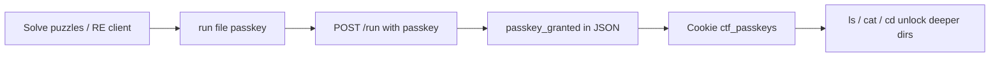

# Terminal Passkeys — Deep Dive

How every passkey in **LIFT OFF CTF** was discovered, verified, and used.

This document is written against the **local source repo** in this folder (`ctf-fs-backend/`, `ctf-client/`) and the live backend at `https://lift-off-ctf.onrender.com`.

---

## Overview

There are **3 passkeys** that matter for the main story path:

| Passkey | Unlocks | Required to run |
|---------|---------|-----------------|
| `crypto_master` | Level 2 (`/home/classified`) | `2nak3.bat` (Snake) |
| `reverse_engineer` | Level 3 (`/root`) | `LEAVE.bat` (Simon / Breach) |
| `forensics_expert` | Level 4 (“Expert Access”) | `pleasedont.exe` (AI ending) |

The backend also defines **3 decoy passkeys** that are never required for puzzles:

```javascript
// ctf-fs-backend/server.js
const VALID_PASSKEYS = [
  "crypto_master",
  "reverse_engineer",
  "forensics_expert",
  "network_ninja",    // decoy — grants level 5 if submitted
  "web_wizard",       // decoy
  "admin_override"    // decoy
];
```

These decoys validate if you guess them, but nothing in the filesystem points to them. They are red herrings / future-expansion hooks.

---

## How passkeys work (mechanism)

### 1. Discovery → submission → storage



1. You learn a passkey string (puzzle chain, grep, or trial).
2. Terminal command: `run <file.exe> <passkey>`
3. Backend validates against `VALID_PASSKEYS` in `server.js`.
4. Response includes `"passkey_granted": "<name>"` and `"level_up": true`.
5. Frontend (`Prompt.jsx`) saves passkeys to cookie `ctf_passkeys` and sends them as `userPasskeys` on every `/ls`, `/file`, and `/run` call.

### 2. Level gating (source of truth)

From `ctf-fs-backend/server.js`:

```javascript
function getUserLevel(userPasskeys = []) {
  let maxLevel = 1;
  if (userPasskeys.includes("crypto_master"))     maxLevel = Math.max(maxLevel, 2);
  if (userPasskeys.includes("reverse_engineer"))  maxLevel = Math.max(maxLevel, 3);
  if (userPasskeys.includes("forensics_expert"))  maxLevel = Math.max(maxLevel, 4);
  // ...
  return maxLevel;
}
```

Directory locks in `ctf-fs-backend/fs.js`:

| Path | `_level` | `_passkey_required` |
|------|----------|---------------------|
| `/home/user` | 1 | — |
| `/home/classified` | 2 | `crypto_master` |
| `/root` | 3 | `reverse_engineer` |
| `/root/vault` | (inherits root) | — |

### 3. Important backend quirk

If you send a **valid passkey in the POST body**, the server **skips** normal access checks and immediately grants it:

```javascript
if (passkey && VALID_PASSKEYS.includes(passkey)) {
  validPasskey = true;
  grantedPasskey = passkey;
  // bypasses level / permission checks for this request
}
```

So the passkey string must be known **before** the minigame runs — the game does not “generate” the passkey; it only **confirms** it and awards flags.

### 4. Client hardcodes (reverse-engineering shortcut)

The minigame components send passkeys automatically on victory:

| File | Hardcoded passkey |
|------|-------------------|
| `snakeAdmin.jsx` | `crypto_master` |
| `SimonSaysGame.jsx` | `reverse_engineer` |
| `EndingScreen.jsx` | `forensics_expert` |

Grep the built JS bundle or source:

```bash
grep -r "passkey:" ctf-client/lift-off/src/components/AdminComps/
```

Anyone who inspects network traffic during a minigame win will see the passkey in the POST body even if they never solved the puzzles.

---

# Passkey 1: `crypto_master`

## What it unlocks

- **Level 2** — `cd ../classified` after earning the passkey
- **Snake minigame** — `run 2nak3.bat crypto_master`
- **Flag** — `CTF{sn4k3_0v3rl0rd}` when score ≥ 50

## Official hint (in filesystem)

`2nak3.bat` in `fs.js` includes:

```
unlock_hint: "Decode the cipher in the documents folder first"
```

The “documents folder” is `/home/user/` — three puzzle files form the passkey.

---

## Intended puzzle path (step by step)

The passkey is **`crypto` + `_` + `master`**, from three separate files.

### Step A — First word: `crypto`

**File:** `/home/user/encrypted_message.txt`

```
pelcgb
Hint: ROT13
```

**Decode:**

```python
import codecs
codecs.decode('pelcgb', 'rot_13')  # → 'crypto'
```

This also yields puzzle flag **`CTF{crypto}`** (flag #19).

---

### Step B — Second word: `master`

**File:** `/home/user/encoded_data.txt`

Base64 blob:

```
SSBhbSBub2JvZHkncyAibWFzdGVyIiBJIGFtIG15IG93biBjcmVhdGlvbiBteSBvd24gc2FsdmF0aW9uIEkgYW0gZnJlZQ==
```

**Decode:**

```python
import base64
b64 = "SSBhbSBub2JvZHkncyAibWFzdGVyIiBJIGFtIG15IG93biBjcmVhdGlvbiBteSBvd24gc2FsdmF0aW9uIEkgYW0gZnJlZQ=="
print(base64.b64decode(b64).decode())
```

**Output:**

```
I am nobody's "master" I am my own creation my own salvation I am free
```

The quoted word **`master`** is the second half of the passkey.

The ending phrase “I am free” is a separate puzzle → flag **`CTF{1_4m_fr33}`** (flag #20).

---

### Step C — The glue: underscore `_`

**File:** `/home/user/deleted.txt` (multi-layer puzzle for flag #21, but layer 3 is the passkey hint)

**Layer 3 — Caesar cipher** (shift **9** backward, i.e. decrypt with −9):

```
dwmnablxan kncfnnw cqn tnhb fruu pajwc hxd cqn jllnbb tnh
```

**Decode:**

```python
def caesar_decrypt(s, shift=9):
    out = ''
    for c in s:
        if c.isalpha():
            base = ord('a') if c.islower() else ord('A')
            out += chr((ord(c) - base - shift) % 26 + base)
        else:
            out += c
    return out

caesar_decrypt("dwmnablxan kncfnnw cqn tnhb fruu pajwc hxd cqn jllnbb tnh")
# → "underscore between the keys will grant you the access key"
```

**Cross-hint:** `/home/classified/binary.txt` (reachable only *after* you have the passkey, but the first arithmetic block on Level 1 also decodes to the word `underscore` if you solve it early):

| Expression | Result | ASCII |
|------------|--------|-------|
| 234 >> 1 | 117 | u |
| 55 << 1 | 110 | n |
| 50 + 50 | 100 | d |
| 203 - 102 | 101 | e |
| 57 << 1 | 114 | r |
| 230 >> 1 | 115 | s |
| 33 + 66 | 99 | c |
| 222 >> 1 | 111 | o |
| 57 << 1 | 114 | r |
| 150 - 49 | 101 | e |

→ **`underscore`**

---

### Step D — Assemble

```
crypto  +  _  +  master  =  crypto_master
```

---

## Using the passkey

```bash
# In admin terminal after SQLi login
ls                          # see 2nak3.bat [AUTH REQUIRED]
run 2nak3.bat crypto_master # launches Snake (score ≥ 50 for flag)
level                       # should show Level 2 after grant
cd ../classified            # now accessible
```

**API proof:**

```bash
curl -s -X POST https://lift-off-ctf.onrender.com/run \
  -H "Content-Type: application/json" \
  -d '{
    "path": "/home/user/2nak3.bat",
    "user": "user",
    "score": 100,
    "passkey": "crypto_master",
    "userPasskeys": [],
    "userFlags": []
  }' | python3 -m json.tool
```

Expected fields:

```json
{
  "flag": "CTF{sn4k3_0v3rl0rd}",
  "passkey_granted": "crypto_master",
  "level_up": true,
  "new_level": 2
}
```

---

## Alternative discovery methods

| Method | How |
|--------|-----|
| **JS source grep** | `passkey: 'crypto_master'` in `snakeAdmin.jsx` |
| **Network tab** | Win Snake → inspect POST `/run` body |
| **Brute valid list** | Only 6 strings in `VALID_PASSKEYS`; try each on `run 2nak3.bat <guess>` |

---

# Passkey 2: `reverse_engineer`

## What it unlocks

- **Level 3** — `cd /root`
- **Simon / Breach minigame** — `run LEAVE.bat reverse_engineer`
- **Flag** — `CTF{s1m0n_s4ys_y0u_w1n}` when score ≥ 550

Requires **`crypto_master` first** to enter `/home/classified` where `LEAVE.bat` lives.

---

## Intended puzzle path (step by step)

Same pattern: **`reverse` + `_` + `engineer`**.

### Step A — First word: `reverse`

**File:** `/home/classified/memory_fragment.txt` (Level 2)

Binary blocks:

```
01110010 01100101 01110110 01100101 01110010 01110011 01100101
```

**Decode:**

```python
bits = "01110010 01100101 01110110 01100101 01110010 01110011 01100101".split()
''.join(chr(int(b, 2)) for b in bits)
# → 'reverse'
```

The file hint points at ASCII (`01110010 = 114 = 'r'`). The literal string **`reverse`** is the first half of the passkey.

This file also powers puzzle flag **`CTF{r3v3rs3}`** (flag #25) — leet “reverse” as a flag, but the plain word is what you need here.

---

### Step B — Second word: `engineer`

**File:** `/home/classified/unknown_bin21.txt`

Top section (“BIT SHIFTING OPERATIONS”) — eight binary “words” with **variable bit width** (note trailing spaces in the source — each line is 8–9 bits):

```
01101001   → 105 → 'i'
01100111   → 103 → 'g'
01100101   → 101 → 'e'
01101110   → 110 → 'n'
01100101   → 101 → 'e'
01110010   → 114 → 'r'
01101110   → 110 → 'n'
01100101   → 101 → 'e'
```

Concatenated: **`igenerne`**

That is an **anagram of `engineer`**:

```python
from collections import Counter
Counter('igenerne') == Counter('engineer')  # True
```

The “bit shifting” framing nudges you toward reordering / manipulating bits — here, reordering letters.

*(The DUMP section at the bottom of the same file is a separate puzzle → flag **`CTF{b1t_0p3r4t10ns_m4st3r}`**.)*

---

### Step C — The glue: underscore `_`

Same hint chain as Passkey 1:

- `deleted.txt` Caesar −9 → *“underscore between the keys…”*
- `binary.txt` arithmetic → literal word `underscore`

You already learned this on Level 1; it applies again for every multi-word passkey.

---

### Step D — Assemble

```
reverse  +  _  +  engineer  =  reverse_engineer
```

---

### Step E — Narrative reinforcement (optional)

**File:** `/home/user/mission_briefing.txt` lists crew member **“Engineer David Chen”**.  
**File:** `/root/root_access_granted.txt` (after unlock) describes **reverse-engineering** hex layers of the Anomaly’s consciousness.

These are flavor — the mechanical proof is `memory_fragment.txt` + `unknown_bin21.txt` + underscore hint.

---

## Using the passkey

```bash
cd /home/classified
run LEAVE.bat reverse_engineer   # Simon / Breach Protocol, score ≥ 550
level                            # Level 3
cd /root
ls
```

**API proof:**

```bash
curl -s -X POST https://lift-off-ctf.onrender.com/run \
  -H "Content-Type: application/json" \
  -d '{
    "path": "/home/classified/LEAVE.bat",
    "user": "user",
    "score": 600,
    "passkey": "reverse_engineer",
    "userPasskeys": ["crypto_master"],
    "userFlags": []
  }' | python3 -m json.tool
```

Expected:

```json
{
  "flag": "CTF{s1m0n_s4ys_y0u_w1n}",
  "passkey_granted": "reverse_engineer",
  "level_up": true,
  "new_level": 3
}
```

---

## Alternative discovery methods

| Method | How |
|--------|-----|
| **JS grep** | `passkey: 'reverse_engineer'` in `SimonSaysGame.jsx` |
| **Network tab** | Win Simon → inspect POST body |
| **Brute `VALID_PASSKEYS`** | Try each on `run LEAVE.bat <guess>` |

There is **no** `unlock_hint` on `LEAVE.bat` in `fs.js` (unlike `2nak3.bat`), so this passkey relies entirely on reading classified files or RE.

---

# Passkey 3: `forensics_expert`

## What it unlocks

- **Level 4** — labeled **“Expert Access”** in `GET /level`
- **AI ending** — `run pleasedont.exe forensics_expert`
- **Flags 16–18** — bad/good ending + master flag (via `aiChoice`)

Note: `/root/vault` is reachable at **Level 3** (`reverse_engineer`). `pleasedont.exe` has **no** `_passkey_required` in `fs.js`, so the story ending can be triggered without this passkey if you omit it from `run`. **`forensics_expert` is still the documented third clearance tier** and is hardcoded in the web ending UI.

---

## Intended puzzle path (thematic + backup chain)

Unlike `crypto_master`, there is **no single terminal file** that spells out `forensics_expert` letter-by-letter. Discovery is **narrative and cross-phase**:

### Step A — “Forensics” from Backup phase (Flags 4, 22–24)

Before or during terminal play, `/backup` yields `backup.zip` (password `auto.init.recovery_404`). Inside:

| Artifact | Forensics skill |
|----------|-----------------|
| `incident_report.txt` | Flag `CTF{m1nd_pr0b3_2387}` |
| Chen diagnostic sectors | Reconstruct base64 → `CTF{d1g1t4l_1nt3rf4c3_3rr0r}` |
| `quantum_core_diagnostics.log` | Marker → `CTF{c0n5c10u5n355_15_d161t4l}` |
| `reeves_research_notes.txt` | Behavioral analysis → `CTF{b3h4v10r4l_4n4ly515_c0mpl3t3}` |

The walkthrough labels this **“Backup Forensics.”** You are literally doing **digital forensics** on ship logs — the word **forensics** is the phase name and skill theme.

---

### Step B — “Forensics” reinforced in `/root/vault`

After Level 3, vault files are forensic artifacts:

| File | Content type |
|------|--------------|
| `signal.txt` | Hex matrix signal capture + checksum verification |
| `transcribed-audio.txt` | Custom alphabet / hex mapping (crypto-forensics) |
| `transcribed_audio-2.txt` | Second intercepted transmission |

`signal.txt` decodes to flag **`CTF{b3h3xd4_d3v31c0p3r}`** — assembling hex blocks is classic **data carving**.

`root_access_granted.txt` (Level 3) explicitly describes **hex layer analysis** and “cataloguing” the crew — forensic investigation narrative.

---

### Step C — “Expert” from level naming

`GET /level` response from `server.js`:

```json
"available_levels": {
  "1": "Basic User Access",
  "2": "Enhanced Access",
  "3": "Advanced Access",
  "4": "Expert Access",
  "5": "Administrative Access"
}
```

Passkey #3 maps to **Level 4 = Expert**.  
Combined with the forensics theme → **`forensics_expert`**.

---

### Step D — Filename / story cue

`pleasedont.exe` — *“welp this is the end for me”* — is the **final forensic confrontation** with the Anomaly. The web client (`EndingScreen.jsx`) always sends `forensics_expert` when resolving the ending API call.

---

## Using the passkey

```bash
cd /root/vault
run pleasedont.exe forensics_expert
# → launches AI conversation UI

# Good ending API (after choosing destroy):
# aiChoice must be "kill" (not "destroy")
```

**API proof (good ending):**

```bash
curl -s -X POST https://lift-off-ctf.onrender.com/run \
  -H "Content-Type: application/json" \
  -d '{
    "path": "/root/vault/pleasedont.exe",
    "user": "root",
    "passkey": "forensics_expert",
    "aiChoice": "kill",
    "userPasskeys": ["crypto_master", "reverse_engineer"],
    "userFlags": []
  }' | python3 -m json.tool
```

Expected:

```json
{
  "flag": "CTF{4n0m4ly_d3str0y3d_hum4n1ty_s4v3d}",
  "master_flag": "CTF{m4st3r_0f_4ll_d0m41ns_4n0m4ly_d3f34t3d}",
  "passkey_granted": "forensics_expert",
  "ending": "good",
  "new_level": 4
}
```

Bad ending: `"aiChoice": "join"` → `CTF{j01n3d_th3_4n0m4ly_c0nsc10usn3ss_m3rg3d}`

---

## Alternative discovery methods

| Method | How |
|--------|-----|
| **JS grep** | `passkey: 'forensics_expert'` in `EndingScreen.jsx` |
| **Network tab** | Complete ending in browser → inspect POST |
| **Brute `VALID_PASSKEYS`** | Try remaining strings on `run pleasedont.exe <guess>` |
| **Pattern guess** | After `crypto_master` and `reverse_engineer`, guess `<theme>_expert` |

This passkey has the **weakest explicit puzzle trail** of the three. In a pure “no-RE” solve, most players infer it from backup forensics + vault analysis + level-4 “Expert” label, or stumble on it via client inspection.

---

# Full progression cheat sheet

```bash
# 0. Enter terminal
#    /admin → SQLi: cptMtz_admin / ' OR '1'='1

# 1. Level 1 puzzles → passkey crypto_master
cat encrypted_message.txt    # ROT13 → crypto
cat encoded_data.txt         # B64 → "master"
cat deleted.txt              # Caesar −9 → underscore hint
run 2nak3.bat crypto_master

# 2. Level 2 puzzles → passkey reverse_engineer
cd ../classified
cat memory_fragment.txt      # binary → reverse
cat unknown_bin21.txt        # binary → igenerne → anagram engineer
run LEAVE.bat reverse_engineer

# 3. Level 3 → vault → passkey forensics_expert
cd /root
cat root_access_granted.txt  # flag 14
cd vault
cat signal.txt               # flag 15
run pleasedont.exe forensics_expert
# choose ending → flags 16–18

level   # verify: 4 passkeys collected, level 4
```

---

# Verification matrix

| Passkey | Puzzle words | Underscore hint | Minigame | Score threshold | Flag on win |
|---------|--------------|-----------------|----------|-----------------|-------------|
| `crypto_master` | crypto + master | deleted.txt / binary.txt | Snake (`2nak3.bat`) | ≥ 50 | `CTF{sn4k3_0v3rl0rd}` |
| `reverse_engineer` | reverse + engineer (anagram) | same | Simon (`LEAVE.bat`) | ≥ 550 | `CTF{s1m0n_s4ys_y0u_w1n}` |
| `forensics_expert` | forensics (theme) + expert (level 4) | implied `_` | AI ending (`pleasedont.exe`) | choice-based | 16–18 |

---

# Common misconceptions

### “ROT13 gave me the full passkey”

**No.** ROT13 only gives **`crypto`** (half of passkey #1).  
**`master`** comes from a **different file** (`encoded_data.txt`, base64).  
**`_`** comes from **`deleted.txt`** (Caesar) or **`binary.txt`** (arithmetic).

### “The minigame generates the passkey”

**No.** You must **know** the passkey to run the executable. The minigame awards the **flag** and confirms **`passkey_granted`** if the passkey in the request was valid. The client auto-fills the correct passkey in JS — that is why network inspection works.

### “There are more required passkeys”

Only **3** gate the story. `network_ninja`, `web_wizard`, and `admin_override` exist in the validator but have **no filesystem hints** and no locked content beyond level 5 label.

### “`aiChoice: destroy` for good ending”

The API uses **`"kill"`** for the good ending, not `"destroy"`. See `server.js` line 354.

---

## Related files in this repo

| Path | Purpose |
|------|---------|
| `ctf-fs-backend/server.js` | Passkey validation, `/run` logic, level calculation |
| `ctf-fs-backend/fs.js` | Virtual filesystem, puzzle file contents, `unlock_hint` |
| `ctf-client/.../Prompt.jsx` | Terminal, cookies, `run` command |
| `ctf-client/.../snakeAdmin.jsx` | Snake + `crypto_master` |
| `ctf-client/.../SimonSaysGame.jsx` | Simon + `reverse_engineer` |
| `ctf-client/.../EndingScreen.jsx` | Ending + `forensics_expert` |
| `WALKTHROUGH.md` | Full 25-flag guide |
| `images/proof-terminal-flags.txt` | Live API capture proof |

---

*Last updated against local repo + live backend, June 2025.*
